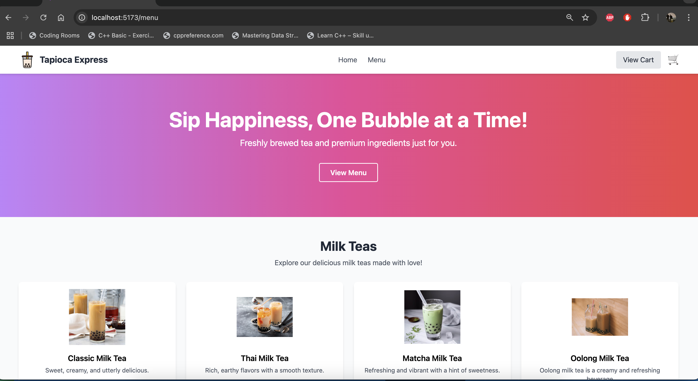

# Tapioca Express

A full-stack application featuring a React frontend and a Node.js/Express backend for ordering tapioca boba drinks.

## Features

*   Browse a menu of boba drinks.
*   Add drinks to a shopping cart.
*   Place an order.
*   (Add more features as applicable)

## Screenshots




## Project Structure

*   `/client`: Contains the React frontend application (built with Vite).
*   `/server`: Contains the Node.js/Express backend API.

## Getting Started

### Prerequisites

*   Node.js and npm (or yarn) installed.
*   (Add any other prerequisites like database setup if needed)

### Installation & Running

**1. Backend Setup:**

```bash
cd server
npm install
# Add command to start the server, e.g.:
# npm start
# or node server.js
```

**2. Frontend Setup:**

```bash
cd client
npm install
# Add command to start the client dev server, e.g.:
# npm run dev
```

Open your browser to the address provided by the client dev server (usually `http://localhost:5173` or similar).

## Technologies Used

*   **Frontend:** React, Vite, Tailwind CSS
*   **Backend:** Node.js, Express
*   (Add database, other libraries)
